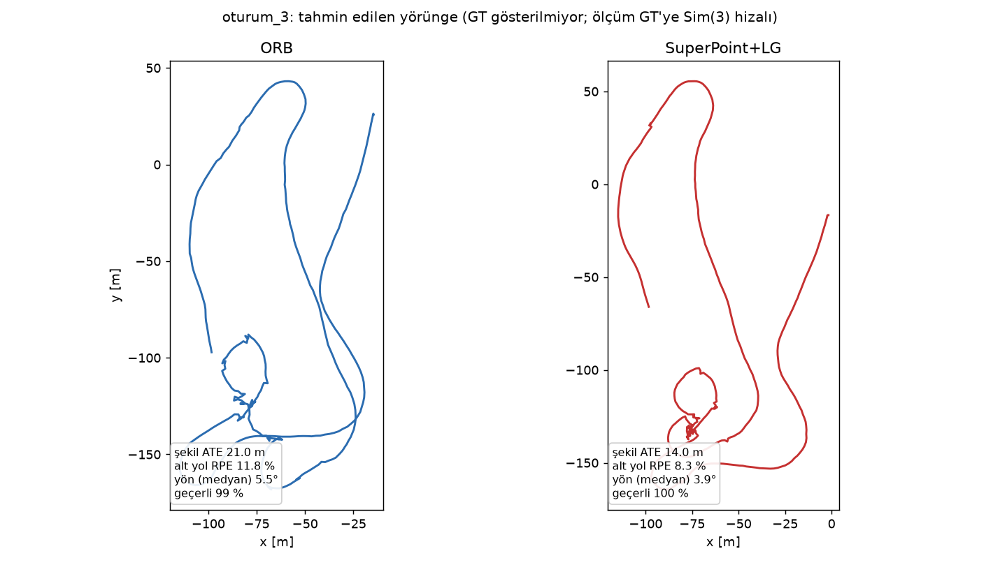
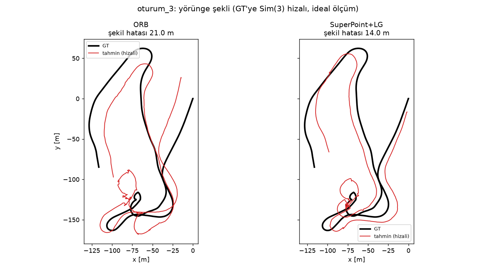

# Tek kameralı görsel odometri (GNSS kullanmadan): sensörsüz çalışma

Bu proje, tek bir kameradan bir drone'un yörüngesini tahmin etmeyi ve bu tahminin ne kadar doğru olabileceğini ölçmeyi amaçlar. Ölçek (metre cinsinden büyüklük) sensörsüz çözülemediği için ana ölçüt olarak yörüngenin GT şekline uyumu (şekil ATE) kullanılmıştır. Ölçekle ilgili bulgular ve sınırlar belgelenmiştir.

Proje kapanmıştır. Kapanış raporu: [KAPANIS_RAPORU.md](KAPANIS_RAPORU.md). Bu çalışmanın devamı, IMU'lu görsel-ataletsel odometri (VIO) olarak ayrı bir repoda yürütülmektedir.

## Yöntem

1. **Özellik ve eşleştirme:** SuperPoint + LightGlue (karşılaştırma: ORB, SIFT+FLANN).
2. **Poz tahmini:** Esansiyel matris (E-only; homografi yolu kapalı).
3. **Birikim:** Birim öteleme ve rotasyonlar, yörünge oluşturacak şekilde birleştirilir.
4. **Ölçek:** Metrik ölçek sensörsüz çözülemedi; ayrı bir sorun olarak raporlanır.

## Değerlendirme

Tüm sayılar tek bir kanonik betikle üretilir:

```
python experiments/evaluate_canonical.py
```

Çıktılar `results/canonical_table.md` ve `results/canonical_table.csv` dosyalarına yazılır. Betik, GT ve veri yollarını yapılandırmadan okur; GT verisi bu repoda yoktur, kendi kopyanızı sağlamanız gerekir.

Ölçütler:
- **Şekil ATE (m):** Tüm yörünge GT'ye Sim(3) ile hizalanır; kalan 3D RMS. Ideal bir ölçümdür (hizalama GT kullanır).
- **Alt yol RPE (%):** KITTI tarzı, 100–800 m alt yollar üzerinde göreli ötelemeyi ölçer.
- **Konum RMSE (m):** İlk 450 karenin GT ile hizalanmasıyla, üretim ölçeğinde ölçülen gerçek konum hatası.
- **Yön hatası (°):** Hizalanmış yörüngenin hız yönü ile GT hız yönü farkı (medyan).

## Sonuçlar (seçilen ayarlar)

| uçuş | ön uç | şekil ATE (m) | alt yol RPE (%) | konum RMSE (m) |
|---|---|---|---|---|
| 2026 | ORB | 40,9 | 24,7 | 67,7 |
| 2026 | SuperPoint+LG | 28,0 | 16,7 | 113,1 |
| oturum_3 | ORB | 21,0 | 11,8 | 41,2 |
| oturum_3 | SuperPoint+LG | 14,0 | 8,3 | 41,3 |
| 2024 (yalnızca XY) | ORB | 72,1 | 19,4 | 153,2 |
| 2024 (yalnızca XY) | SuperPoint+LG | 44,1 | 13,3 | 119,2 |

Notlar:
- Ayarlar, her ön uç için aynı bütçeyle (6 kombinasyon) ve yalnızca 2026 ile oturum_3 üzerinde seçildi; 2024 bağımsız kontroldür.
- 2024 verisinde GT yüksekliği yoktur; yalnızca XY metriği hesaplanır, diğer uçuşlarla mutlak karşılaştırma yapılmaz.
- Konum RMSE, ölçek sorunu nedeniyle büyüktür; şekil ölçütü bu sorundan bağımsız değildir ama ondan etkilenmez.

## Görseller

oturum_3 uçuşunun tahmin yörüngesi (GT gösterilmeden, doğruluk oranlarıyla):



Diğer uçuşlar için: `results/figures_nogt/`. Yalnızca çubuk grafikler: `results/figures/`.

oturum_3 uçuşunun GT ile karşılaştırması (ORB ve SuperPoint+LG, GT hizalı):



Bu görseldeki GT, yarışma verisinden gelir; yayın izni yazılı olarak teyit edilmiştir.

## Bulgular ve sınırlar

- Metrik ölçek, sensörsüz tek kameradan çözülemedi; paralaks, GT irtifası, semantik irtifa, yön ölçümü ve BA ile iyileştirme denendi, sonuç değiştirmedi.
- Adım başına rotasyon hatası (~0,5°) yörüngede birikir ve şekli bozar. Yön hatasının büyük kısmı rotasyon kaynaklıdır.
- Döngü kapanışı ve BA bu hatta uygulanmadı; sonuçlar bu nedenle sınırlıdır.
- Gerçek zamanlılık ölçülmedi; sonuçlar kayıtlı adım çıktısıyla üretildi.
- 2026 üretim yapılandırması GT irtifa bilgisini kullanır; mutlak sayılar bu nedenle iyimser olabilir. İki ön uç aynı koşulda karşılaştırıldığı için göreli sonuç geçerlidir.

## Klasör yapısı

- `core/`: pipeline modülleri (özellik, eşleştirme, poz, ölçek, poz grafiği).
- `utils/`: veri yükleyici ve kamera kalibrasyonu.
- `experiments/`: kanonik değerlendirme, figürler, EuRoC doğrulama betikleri.
- `results/`: sonuç tabloları ve GT içermeyen figürler.
- `config.yaml`: üretim (ORB) yapılandırması. `config_final_sp_eonly.yaml`: SuperPoint+LG, yalnızca E.
- `main.py`: giriş noktası.
- `archive/`: deneysel betikler, test yapılandırmaları, eski notlar ve belgeler. Repoyu yeniden üretmek için gerekmez; tarihçe için saklanır.

## Yapılandırma

Veri yolları, kamera parametreleri ve ayarlar `config*.yaml` dosyalarında tanımlanır. Veri ve GT bu repoda bulunmaz (`.gitignore` ile dışlanmıştır).

## Lisans

Kod için henüz bir lisans seçilmedi. Kullanılan veri setleri kendi lisanslarına tabidir.
