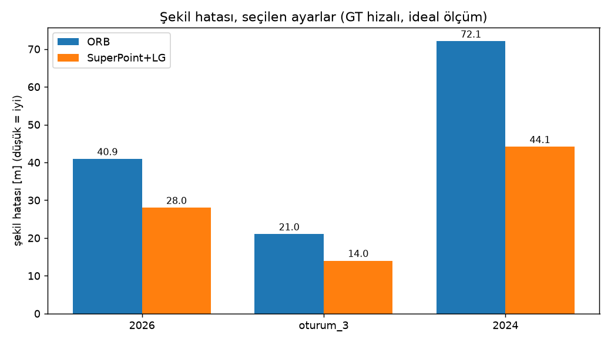
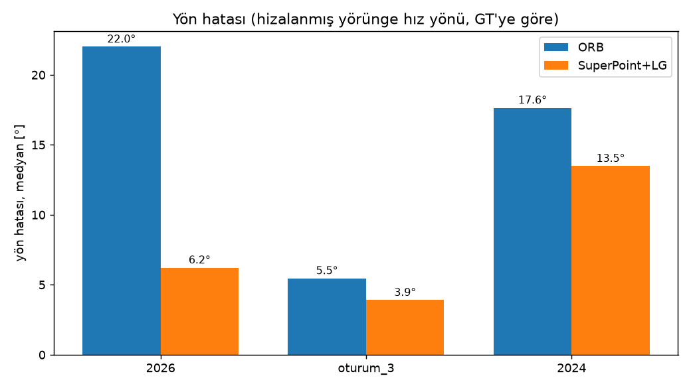
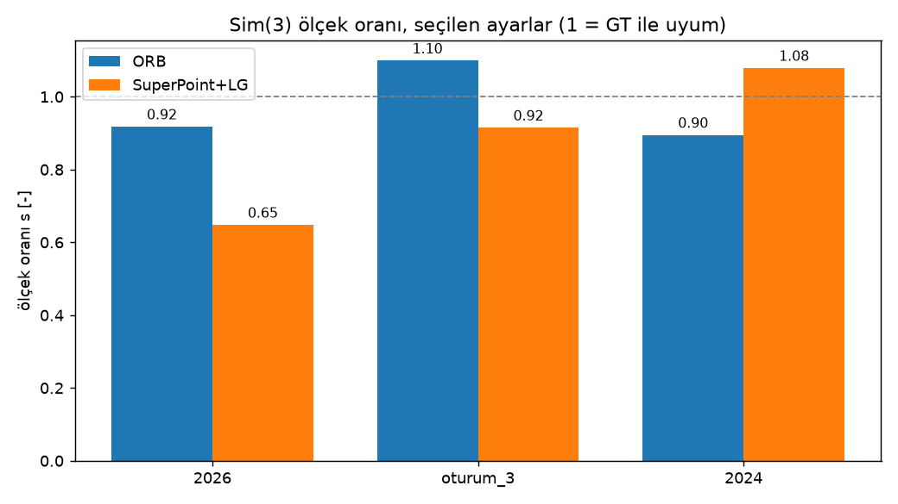

# Tek kameradan GNSS'siz yörünge tahmini: ölçek neden çözülmedi

## Giriş

Bu projede tek bir kameradan, GPS olmadan bir drone'un nereden nereye uçtuğunu çıkarmaya çalıştım. Buna görsel odometri deniyor. Kamera her karede bir öncekine göre ne kadar döndüğünü ve hangi yöne kaydığını söyleyebiliyor. Ama kaydığı mesafenin kaç metre olduğunu söyleyemiyor. Bu, tek kameralı sistemlerin bilinen en büyük sorunu ve bu çalışmanın asıl konusu da bu.

Başta hedefim yarışmadaki gibi konum hatasını (RMSE) mümkün olduğunca düşürmekti. Ölçek çözülemediği için konum hatası bu sistemin asıl kalitesini yansıtmıyor. Bu yüzden ana ölçütü yön hatasına çevirdim. Konum hatasını yine de raporluyorum, çünkü yarışmanın ölçütü bu ve 2026'daki kötüleşme sonucun parçası. Hatalı yorumlarımı da geri çektim; bunlar da sonucun bir parçası.

## Veri ve ölçütler

Üç uçuş kullandım: 2026 ve oturum_3 yarışmanın sağladığı iki uçuş, 2024 ise yalnızca XY düzleminde değerlendirilebilen bir uçuş (yüksekliği yok). Veriyi TEKNOFEST Havacılıkta Yapay Zeka Yarışması sağladı; kullanım koşulları organizatörlere ait.

Değerlendirmede dört şeye baktım:

- **Yön hatası (ana ölçüt):** Hızın yönü ile GT'deki hızın yönü arasındaki fark (medyan). Ölçeğe bağlı olmadığı için bu sistemde en güvenilir ölçüt bu.
- **Alt yol hatası (RPE):** KITTI'deki gibi 100 ile 800 metre arasındaki alt yollarda, yol uzunluğuna oranla göreli öteleme hatası.
- **Şekil hatası (ATE):** Tüm yörünge GT'ye Sim(3) ile hizalanıyor ve kalan hata ölçülüyor. Hizalamayı GT ile yaptığım için bu ideal bir ölçüm; uçuşta elde edemeyeceğim bir sayı.
- **Konum hatası (RMSE, ikincil):** İlk 450 karenin GT ile hizalanmasından sonra, ölçekle birlikte ölçülen konum hatası. Ölçek yanlış olduğu için bu sayı ana ölçüt değil.

Her ön ucu aynı bütçeyle, altı ayar kombinasyonuyla denedim. Seçimi yalnızca 2026 ve oturum_3 üzerinde yaptım; 2024'ü seçimden bağımsız bir kontrol olarak tuttum.

## Yöntem

Özellik çıkarımı için SuperPoint, eşleştirme için LightGlue kullandım. LightGlue eşiğini 0,10'da tuttum. Karşılaştırma için klasik ORB'a baktım.

Poz tahmininde esansiyel matrisle dönüş ve birim öteleme elde ediliyor. Homografi yolunu kapattım. SuperPoint'te homografinin sonucu değiştirmediğini, ORB'da ise bir miktar katkısı olduğunu gördüm; sadeliği korumak için kapalı tutmayı seçtim. Adımları birikimli olarak birleştirdim ve düz uçuş varsayımıyla yükseklik bileşenini sıfırladım.

## Sonuçlar

| uçuş | ön uç | yön hatası (°) | alt yol RPE (%) | şekil ATE (m) | konum RMSE (m, ikincil) |
|---|---|---|---|---|---|
| 2026 | ORB | 22,0 | 24,7 | 40,9 | 67,7 |
| 2026 | SuperPoint+LG | 6,2 | 16,7 | 28,0 | 113,1 |
| oturum_3 | ORB | 5,5 | 11,8 | 21,0 | 41,2 |
| oturum_3 | SuperPoint+LG | 3,9 | 8,3 | 14,0 | 41,3 |
| 2024 (yalnızca XY) | ORB | 17,6 | 19,4 | 72,1 | 153,2 |
| 2024 (yalnızca XY) | SuperPoint+LG | 13,5 | 13,3 | 44,1 | 119,2 |

ORB'dan SuperPoint+LG'ye geçişte değişim:

| uçuş | yön hatası | alt yol RPE | şekil ATE | konum RMSE (ikincil) |
|---|---|---|---|---|
| 2026 | −%71,8 | −%32,4 | −%31,5 | +%67,1 |
| oturum_3 | −%28,4 | −%29,1 | −%33,4 | +%0,1 |
| 2024 (yalnızca XY) | −%23,6 | −%31,3 | −%38,7 | −%22,2 |

En net değişim yön hatasında: 2026'da medyan 22,0°'den 6,2°'ye indi ve üç uçuşun üçünde de düştü. Alt yol ve şekil hatası da üç uçuşta düştü. Konum RMSE'si ise tutarlı değil: 2026'da arttı, oturum_3'te değişmedi, 2024'te düştü. Ölçek yanlış olduğu için bu sayıyı ana sonuç değil, sistemin sınırının göstergesi olarak okumak gerekir.

Şekil hatasının dağılımı için aşağıdaki grafiğe bakılabilir.

Konum hatası ise bu tabloda ayrı bir hikâye anlatıyor. 2026'da SuperPoint ile konum hatası 113 metre, ORB ile 68 metre. Yani yönü ve şekli daha iyi yakalayan ön uç, metrik olarak daha kötü bir yörünge üretti. Bunun büyük olasılıkla sebebi ölçek: şekil doğru olabilir ama boyut yanlışsa konum hatası büyür.

Yörüngenin şekli, GT'siz bir figürle de görülebilir. Aşağıda oturum_3 için iki ön ucun tahmini yer alıyor; GT çizilmedi, hizalama yalnızca ölçüm için kullanıldı.

### ORB ile karşılaştırma

Tabloyu sayılarla okuyunca şu tablo çıkıyor:

- **Şekil:** SuperPoint, ORB'a göre şekil hatasını 2026'da yaklaşık yüzde 32, oturum_3'te yüzde 33, 2024'te yüzde 39 azalttı. Üç uçuşta da aynı yönde.
- **Alt yol hatası:** 24,7'den 16,7'ye, 11,8'den 8,3'e, 19,4'ten 13,3'e düştü. Şekil ile aynı yönde.
- **Yön hatası:** Bence en net sonuç bu. 2026'da medyan yön hatası 22,0°'den 6,2°'ye indi. Oturum_3'te 5,5°'den 3,9°'ye, 2024'te 17,6°'den 13,5°'ye.

- **Konum:** Burada tablo karışık. 2026'da SuperPoint konumda kötü (67,7 m'den 113,1 m'ye). Oturum_3'te neredeyse eşit (41,2 m ve 41,3 m). 2024'te SuperPoint daha iyi (153,2 m'den 119,2 m'ye), ama o uçuşta yalnızca XY ölçülebiliyor.

Konumdaki bu tutarsızlığın kaynağı ölçek oranı (`s`) gibi görünüyor. 2026'da ORB 0,92, SuperPoint 0,65 buldu. Oturum_3'te 1,10'a karşılık 0,91, 2024'te 0,89'a karşılık 1,08. Ön uç değiştiğinde ölçek tahmini de değişiyor, ama değişim uçuşlar arasında tutarlı bir yöne gitmiyor. Bu, ölçek hatasının şekilden bağımsız ve ön uca bağlı olduğunu düşündürüyor. Hangi ön ucun ölçeği daha doğru bulduğunu ise bu verilerle söyleyemem, çünkü ölçek için GT'de tek bir doğru değer yok.

Bu karşılaştırmanın sınırları var. Ayar seçimi ve değerlendirme aynı iki uçuşta yapıldı; 2024 yalnızca XY'de bağımsız bir kontrol. Üç uçuş, bir ön ucun diğerinden üstün olduğu sonucunu güvenle genellemeye yetmez. Yalnızca şekil ve yön tarafında iki ön ucun tutarlı farklılık gösterdiğini söyleyebilirim.

## Ölçeği çözmek için denediklerim

Ölçeği bulmak için birkaç yol denedim ve hiçbiri işe yaramadı.

Paralaks farkına dayalı bir ayırım yaptım: yakın ve uzak noktaları ayırıp ölçeğin değişip değişmediğine baktım. Oran değişmedi.

Yerdeki yüksekliği ölçek kaynağı olarak kullanmayı denedim. Yarışmanın GT irtifasını ideal bir barometre gibi kullandığımda 2026'da sonuç düzelmedi, tam tersine kötüleşti; oran 1,04'ten 1,16'ya çıktı. Semantik olarak tahmin ettiğim irtifa da bir uçuşta zayıftı. Ayrıca veri setinde başlangıç irtifası verilmiyor, GT yalnızca ilk kareye göre yer değiştirme veriyor. Bu da irtifaya dayalı yöntemleri baştan belirsiz kılıyor.

Yön hatasını ölçmek için bir araç yazdım. Sonradan anladım ki bu araç yön hatasını değil, hizalamanın titreşimini ölçüyormuş. O yüzden o sonuçları geri çektim.

Bundle adjustment de denendi, ölçek sorununu çözmedi.

Bu sonuçlara bakınca, yalnızca tek kamera ve GT dışında bir çapa olmadan ölçeği güvenilir biçimde çözemediğimi düşünüyorum. Bu yeni bir bulgu değil; literatürdeki birçok çalışma da ölçeği bir IMU, barometre, mesafe ölçer ya da ortofoto gibi harici bir kaynakla sabitliyor.

## Sınırlar

Ölçek çözülmedi, bu yüzden konum hatası büyük. Şekil hatası ideal bir ölçüm, çünkü hizalamayı GT ile yapıyorum.

Adım başına yaklaşık yarım derecelik bir rotasyon hatası var ve uzun uçuşta birikiyor. Şekil hatasının asıl kaynağı bu olabilir. Döngü kapanışı uygulamadım; birikmiş hatayı geri alacak bir mekanizma yok.

Gerçek zamanlı çalışmayı ölçmedim; sonuçlar kayıtlı adım çıktılarından üretildi.

2024 uçuşunda yükseklik GT'si olmadığı için yalnızca XY düzleminde karşılaştırma yapabildim. Bu yüzden onu diğer uçuşlarla doğrudan karşılaştıramıyorum.

2026 üretim yapılandırması GT irtifasını kullanıyor; bu mutlak sayıları olduğundan iyi gösteriyor olabilir. İki ön ucu aynı koşulda karşılaştırdığım için göreli sonuç yine de geçerli.

## Bundan sonra

Ölçek sorununu asıl çözecek şeyin ek bir sensör olacağını düşünüyorum. Bu yüzden IMU'lu görsel-ataletsel odometri (VIO) üzerine yeni bir projeye başladım. Proje henüz başlangıç aşamasında; ölçeğin IMU ile nasıl gözlemlenebileceği ve bu projenin başarısı da bu sorunun nasıl ele alındığına bağlı olacak. Henüz yeterli sonuç olmadığı için burada sonuç paylaşmıyorum.

## Teşekkür

Çalışmadaki uçuş verileri TEKNOFEST Havacılıkta Yapay Zeka Yarışması'nın sağladığı veriler. Bu veriyi hazırlayan ve paylaşan TEKNOFEST ekibine teşekkür ederim. Verinin kullanım koşulları organizatörlere ait, bu yüzden veriyi yeniden dağıtmıyorum.

## Kaynaklar

- Campos, C., Elvira, R., Gómez Rodríguez, J. J., Montiel, J. M. M., & Tardós, J. D. (2021). ORB-SLAM3: An accurate open-source library for visual, visual-inertial and multi-map SLAM. *IEEE Transactions on Robotics*, 37(6), 1874–1890. https://doi.org/10.1109/TRO.2021.3075644 · arXiv: https://arxiv.org/abs/2007.11898
- Qin, T., Li, P., & Shen, S. (2018). VINS-Mono: A robust and versatile monocular visual-inertial state estimator. *IEEE Transactions on Robotics*, 34(4), 1004–1020. https://doi.org/10.1109/TRO.2018.2853729 · arXiv: https://arxiv.org/abs/1708.03852
- Jiang, C., Zheng, X., Jin, Z., & Yu, C. (2023). UMS-VINS: United monocular-stereo features for visual-inertial tightly coupled odometry. arXiv: https://arxiv.org/abs/2303.08550. Dergi sürümü 2025'te *Unmanned Systems* içinde, farklı bir başlıkla yayımlandı: https://doi.org/10.1142/S2301385025420051
- Syed, S., ve ark. (2025). SuperPoint-SLAM3: Augmenting ORB-SLAM3 with deep features, adaptive NMS, and learning-based loop closure. arXiv: https://arxiv.org/abs/2506.13089
- Dhaouadi, O., Bauer, Z., Meier, J. M., Wysocki, O., Pollefeys, M., & Cremers, D. (2026). OrthoTrack: Continuous 6-DoF UAV trajectory estimation anchored in public orthophotos. arXiv: https://arxiv.org/abs/2606.25245 · Springer: https://link.springer.com/chapter/10.1007/978-3-032-37553-7_4
- AerialMetric: Benchmarking and adapting UAV monocular metric depth estimation in the real world. arXiv: https://arxiv.org/abs/2606.29716 · ECCV 2026: https://github.com/kuieless/AerialMetric
- Zhou, D., Dai, Y., & Li, H. Ground plane based absolute scale estimation for monocular visual odometry. arXiv: https://arxiv.org/abs/1903.00912
- Tian, R., Zhang, Y., Zhu, D., Liang, S., Coleman, S., & Kerr, D. (2021). Accurate and robust scale recovery for monocular visual odometry based on plane geometry. *IEEE ICRA 2021*. https://ieeexplore.ieee.org/document/9561215/ · arXiv: https://arxiv.org/abs/2101.05995
- DeTone, D., Malisiewicz, T., & Rabinovich, A. (2018). SuperPoint: Self-supervised interest point detection and description. *CVPR Workshops*, 224–236. https://doi.org/10.1109/CVPRW.2018.00060
- Lindenberger, P., Sarlin, P.-E., & Pollefeys, M. (2023). LightGlue: Local feature matching at light speed. *ICCV 2023*. https://openaccess.thecvf.com/content/ICCV2023/html/Lindenberger_LightGlue_Local_Feature_Matching_at_Light_Speed_ICCV_2023_paper.html
- Umeyama, S. (1991). Least-squares estimation of transformation parameters between two point patterns. *IEEE TPAMI*, 13(4), 376–380. https://doi.org/10.1109/34.88573
- Geiger, A., Lenz, P., & Urtasun, R. (2012). Are we ready for autonomous driving? The KITTI vision benchmark suite. *CVPR 2012*. https://dblp.org/rec/conf/cvpr/GeigerLU12.html
- Geiger, A., Lenz, P., Stiller, C., & Urtasun, R. (2013). Vision meets robotics: The KITTI dataset. *IJRR*, 32(11). https://doi.org/10.1177/0278364913491297
- Burri, M., Nikolic, J., Gohl, P., ve ark. (2016). The EuRoC micro aerial vehicle datasets. *IJRR*, 35(10), 1157–1163. https://projects.asl.ethz.ch/datasets/euroc-mav/
